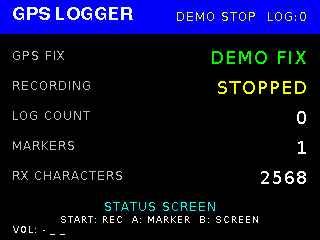

# PRUZEA mini

> **AI-Friendly Game / UI Application Framework for Arduino IDE**

A lightweight framework for creating games and UI applications with AI assistance.

------------------------------------------------------------------------

# Features

`PRUZEA mini` is a streamlined version of [PRUZEA](https://github.com/mshujp/PRUZEA/) adapted for the Arduino IDE.
For the full feature set, use PRUZEA instead.

-   Supports the creation of a single application.
-   AI-friendly public API
-   Portable application code across supported Arduino-compatible platforms
-   Unified Graphics / Input / Audio / Storage APIs
-   Supports games, UI applications, sensor monitoring, and data logging.
-   Fixed 30 FPS application loop
-   Built-in SaveData helper
-   2D camera, zoom, clipping, viewport, and scrolling support
-   2D game utilities for vectors, animation, tweening, math, and collision detection
-   SpriteSheet rendering support
-   PWM / I2S audio support
-   ILI9341 (SPI / Parallel) and SSD1306 display support
-   AI-oriented documentation and API design
-   Embedded JPEG / PNG image support
-   RGB565 sprite scaling, rotation, flipping, and color-key transparency
-   ToneNote and embedded SMF Format 0 / 1 MIDI playback
-   Simultaneous background music and sound-effect mixing
-   GPIO buttons, gamepads, analog sticks, and touchscreen input

- **Supported platforms**
  - Raspberry Pi Pico family
    - RP2040
    - RP2350
  - ESP32 family
  

| Hardware |  |
| :---: | :---: |
|  |  |
|  |  |

| Screenshots | |
| :---: | :---: |
|  |  |
|  |  |
|  |  |
|  |  |
|  |  |

------------------------------------------------------------------------

# Philosophy

PRUZEAmini is designed so that both humans and AI can create games and UI applications using the same simple API.

Applications implement only a small set of interfaces, while the runtime manages graphics, input, audio, storage, and the application loop.

This keeps game and UI logic clean, portable, and easy to generate.

------------------------------------------------------------------------

# Build Requirements

## Required tools

-   Arduino IDE

------------------------------------------------------------------------

# Install

Download this project as a ZIP file, then install it from the Arduino IDE menu:
`Sketch` → `Include Library` → `Add .ZIP Library...`

------------------------------------------------------------------------

# Creating an App

To create a game or UI application, define **one class** that inherits from `PRUZEAmini::App`.

The PRUZEAmini runtime automatically manages the application loop, rendering, input, audio, and storage.

Your app only needs to implement its own game or UI logic.

## Core API

PRUZEAmini provides the following hardware abstraction interfaces to every application.

Application code does not need to access platform-specific hardware or drivers directly.

| Class | Purpose |
|------|---------|
| `PRUZEAmini::Graphics` | Drawing API for text, shapes, images, and sprites. |
| `PRUZEAmini::Input` | Controller input, button state, repeat, and hold detection. |
| `PRUZEAmini::Audio` | Play sound effects and music. |
| `PRUZEAmini::Storage` | Read and write save data and configuration files. |

For the complete API reference, see:

- [`src/PRUZEAmini.h`](src/PRUZEAmini.h)

## Hardware Configuration

See the example [00B_Hardware_Setup](examples/00B_Hardware_Setup/00B_Hardware_Setup.ino)

## `PRUZEAmini::App` class

Your application class should inherit from the `PRUZEAmini::App` class.

Most applications implement their application logic in:

- `getId()`
- `onInit()`
- `onUpdate()`
- `onDraw()`
- `onTerminate()`

For the complete `PRUZEAmini::App` class reference, see:

- [`src/PRUZEAmini.h`](src/PRUZEAmini.h)

## Resource Files

### Image
- Embedded JPEG, PNG, and RGB565 images are supported.
- Sprites support scaling, rotation, flipping, and color-key transparency.

### Audio
- ToneNote sound effects, ToneNote music, and MIDI music are supported.
- ToneNote music and MIDI music can play simultaneously with sound effects.
- Embedded MIDI supports SMF Format 0 and Format 1.


## AI Workflow

PRUZEAmini is designed for AI-assisted game and UI application development.

See the example [00A_AI_Game_Generation](examples/00A_AI_Game_Generation/00A_AI_Game_Generation.ino)

------------------------------------------------------------------------

# Samples

| Sample | Description |
|--------|-------------|
| [00A_AI_Game_Generation](examples/00A_AI_Game_Generation/00A_AI_Game_Generation.ino) | AI-assisted game generation workflow |
| [00B_Hardware_Setup](examples/00B_Hardware_Setup/00B_Hardware_Setup.ino) | Hardware configuration reference |
| [01_Hello_PRUZEA](examples/01_Hello_PRUZEA/01_Hello_PRUZEA.ino) | Minimal PRUZEAmini game |
| [01_Hello_PRUZEA_SSD1306](examples/01_Hello_PRUZEA_SSD1306/01_Hello_PRUZEA_SSD1306.ino) | Minimal PRUZEAmini game |
| [02_Input_Basics](examples/02_Input_Basics/02_Input_Basics.ino) | Button input and movement |
| [03_Graphics_Basics](examples/03_Graphics_Basics/03_Graphics_Basics.ino) | Shapes, colors, fonts, and alignment |
| [04_Audio_Basics](examples/04_Audio_Basics/04_Audio_Basics.ino) | Sound effects and music |
| [05_Save_Data](examples/05_Save_Data/05_Save_Data.ino) | SaveData loading and saving |
| [06_Collision](examples/06_Collision/06_Collision.ino) | Collision detection APIs |
| [07_Animation](examples/07_Animation/07_Animation.ino) | Time-based animation and Tween |
| [08_Breakout](examples/08_Breakout/08_Breakout.ino) | Complete action game |
| [09_Star_Dodge](examples/09_Star_Dodge/09_Star_Dodge.ino) | Avoidance game with effects |
| [10_Reversi](examples/10_Reversi/10_Reversi.ino) | Board game and CPU logic |
| [11_Memory_Tiles](examples/11_Memory_Tiles/11_Memory_Tiles.ino) | Memory game with state transitions |
| [12_IMU_Monitor](examples/12_IMU_Monitor/12_IMU_Monitor.ino) | IMU sensor monitoring and simple tilt visualization |
| [13_GPS_Logger](examples/13_GPS_Logger/13_GPS_Logger.ino) | GPS monitoring and CSV data logging to an SD card |
| [14_Touchscreen](examples/14_Touchscreen/14_Touchscreen.ino) | Touch input and coordinate visualization |
| [15_Analog_Stick](examples/15_Analog_Stick/15_Analog_Stick.ino) | Analog stick input |
| [16_MP3_Deck](examples/16_MP3_Deck/16_MP3_Deck.ino) | Touch-controlled MP3 player with SD card and I2S audio |
| [17_Image_Showcase](examples/17_Image_Showcase/17_Image_Showcase.ino) | JPEG and PNG image rendering |
| [18_MIDI_Music_Box](examples/18_MIDI_Music_Box/18_MIDI_Music_Box.ino) | Embedded SMF Format 0 / 1 MIDI playback |
| [19_SpriteSheet](examples/19_SpriteSheet/19_SpriteSheet.ino) | Draws individual sprites from a single sprite sheet image. |
| [20_Maze_Escape](examples/20_Maze_Escape/) | Advanced gameplay and visual effects |
| [Application Template](examples/Template/Template.ino) | Blank application template for creating new games or applications |
| [Games](examples/Games/) | Complete game examples built with PRUZEAmini |

Each sample is placed under the [`examples`](examples) directory.

## Learning Path

The examples are intended to be completed in numerical order.
Each example introduces one or more new concepts while building on previous examples.

------------------------------------------------------------------------

## Recommended AI

PRUZEAmini is designed to work with modern AI coding assistants.

Based on current development experience:

| AI | Recommendation | Notes |
|----|---------------|-------|
| **ChatGPT** | **Highly Recommended** | Best overall experience with PRUZEAmini |
| **Claude** | **Recommended** | Strong at understanding the SDK and generating well-structured application code |
| **Gemini** | **Not Recommended** | Gemini struggles with interpreting the contents of the ZIP file. |
| **Copilot** | **Not Recommended** | Does not currently support zip file uploads, making it difficult to provide the PRUZEAmini SDK. |
| **Google Search AI Mode** | **Not Recommended** | Does not currently support file uploads, making it difficult to provide the PRUZEAmini SDK. |

------------------------------------------------------------------------

# Hardware Notes

## Minimum Configuration

- **Main board:** RP2040  
  Examples: Waveshare RP2040 Zero
- **Input:** One or more tactile switches
  Simple applications may need only one or two buttons. Games may use a D-pad, A, and B.
- **Display:** SSD1306
- **Audio:** PWM  
  Add a potentiometer for volume adjustment if needed.
- **Storage:** Emulated EEPROM  
  Uses the board's built-in flash storage.

## Standard Configuration

- **Main board:** RP2350 or ESP32  
  Examples: Raspberry Pi Pico 2 or ESP32
- **Input:** About 7 tactile switches  
  D-pad, A, B, and Start
- **Display:** ILI9341
- **Audio:** I2S
- **Storage:** SD card reader

## Pin Assignment Advice

Ask an AI assistant to read this page, then describe your hardware configuration and request advice on suitable pin assignments.

## GPIO BUTTONS

Internal pull-up resistors are used.

## SD Card SPI

For SD card builds, the following configuration is recommended and has been verified on both RP2040 and RP2350.

| Peripheral | SPI |
|------------|-----|
| ILI9341 LCD | SPI1 |
| SD Card | SPI0 |

This configuration has been verified on both RP2040 and RP2350 and is recommended for best compatibility.

### SD Card

Use an SDHC or SDXC card with a capacity of 4 GB or more.

Although the Arduino-based PRUZEAmini implementation may work with some 2 GB standard SD cards,
they are not officially supported. This keeps SD card requirements consistent with the full PRUZEA framework.

> [!WARNING]
> Although PRUZEAmini provides a software shutdown option, embedded systems can still lose power unexpectedly (for example, due to battery removal or depletion).
> Do **not** store important or irreplaceable data on the SD card.

## Touchscreen

Touchscreen input is an optional extension to the primary button input.
It is intended for secondary-screen-style interaction and does not replace system menu controls.

PRUZEA supports ILI9341 display modules with an integrated XPT2046 touchscreen controller.

For builds that use both a touchscreen and an SD card, the following configuration is recommended:

| Peripheral | SPI |
|------------|-----|
| ILI9341 LCD | SPI1 |
| XPT2046 Touchscreen | SPI1 |
| SD Card | SPI0 |

The touchscreen and ILI9341 card may share the SPI1 clock, MOSI, and MISO pins.
They must use separate CS pins.

The IRQ pin is optional.
Set `irqPin` to `-1` when it is not connected.
In that case, PRUZEA detects touch input by polling the XPT2046 controller.

## PWM Audio

Use a passive buzzer or an appropriate transistor/amplifier circuit.
Do not connect a low-impedance speaker directly to a GPIO pin.

PWM audio supports only **MUTE** or **ON**.
If adjustable volume is required, use an external amplifier or a potentiometer.

## I2S

For RP2040 and RP2350, PRUZEAmini uses the I2S library included with the Earle Philhower Arduino-Pico core. LRCLK/WS must use the GPIO immediately following BCLK.

## Analog Stick

PRUZEAmini supports the analog sticks of PlayStation 1 and PlayStation 2 controllers.

Analog stick values are normalized to the range `-1000` to `1000`.

```cpp
const int16_t moveX = input.axis(Input::Axis::LEFT_X);
const int16_t moveY = input.axis(Input::Axis::LEFT_Y);
```

------------------------------------------------------------------------

## PRUZEAmini Hardware Compatibility

| Platform | ILI9341 SPI | ILI9341 Parallel | SSD1306 | PWM Audio | I2S Audio | GPIO Buttons | SNES Pad | PS Pad | Emulated EEPROM | SD Card |
|---|:---:|:---:|:---:|:---:|:---:|:---:|:---:|:---:|:---:|:---:|
| RP2040 | ✅ | ✅ | ✅ | ✅ |  | ✅ |  |  | ✅ | ✅ |
| RP2350 | ✅ |  |  |  | ✅ |  | ✅ | ✅ | ✅ | ✅ |
| ESP32 | ✅ |  | ✅ | ✅ | ✅ | ✅ |  |  | ✅ | ✅ |
| ESP32-S3 |  |  |  |  |  |  |  |  |  |  |
| ESP32-C3/C6 |  |  |  |  |  |  |  |  |  |  |

- ✅: Verified on actual hardware
- Blank: Not yet tested. A blank cell does **not** mean unsupported or incompatible.
  Some untested combinations may already be supported by the implementation, but they have not yet been verified on physical hardware.

Hardware test reports are welcome, especially for currently unverified boards such as ESP32-S3, ESP32-C3, and ESP32-C6.

------------------------------------------------------------------------

## Flexible by Design

PRUZEA mini does not require applications to use every built-in subsystem.
Graphics, input, audio, and storage can be replaced with stub implementations when an application manages those features directly.

This allows applications to use Arduino libraries and hardware APIs for features such as touchscreens, sensors, MP3 playback, network radio, and custom I2S audio.

------------------------------------------------------------------------

# License

MIT License

## Third party License

This project includes a minimized subset of LovyanGFX 1.2.26.

Only the components required by PRUZEAmini are included.
Unused panels, buses, touch drivers, platform implementations, and font data have been removed.

The original copyright notices and applicable license files for all retained components are preserved.
